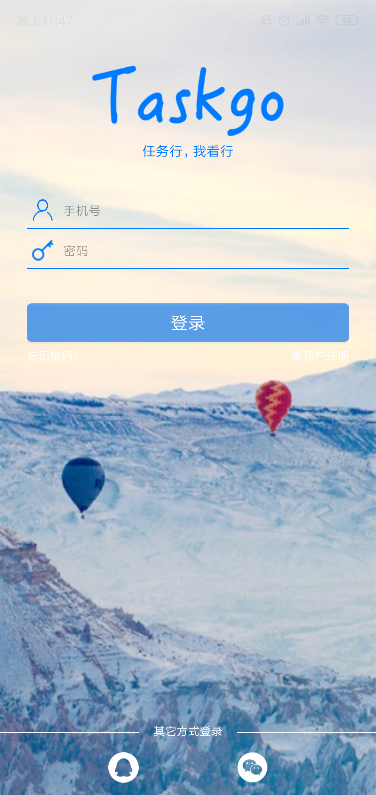
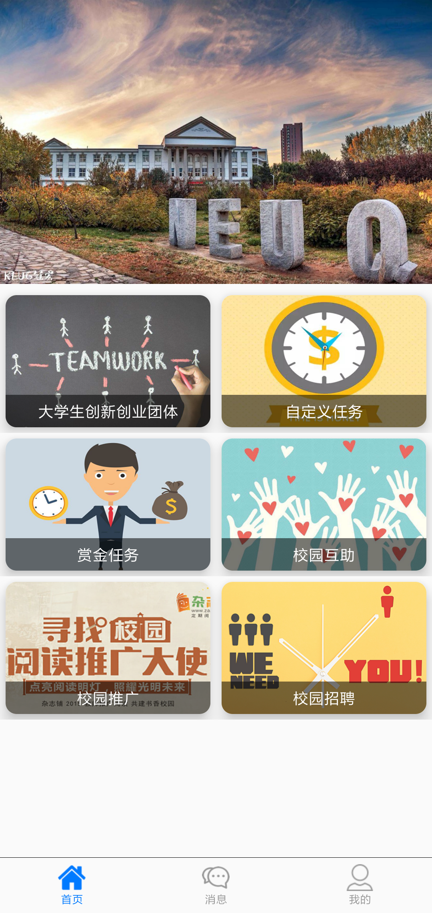
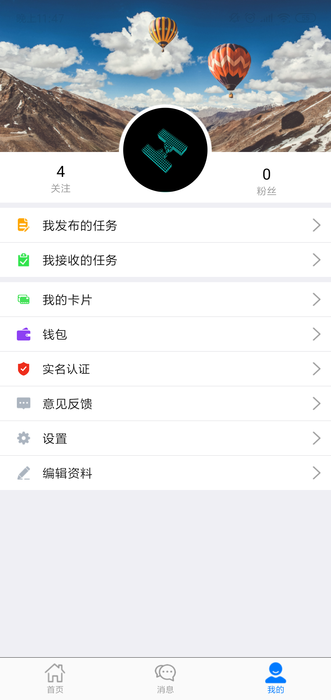
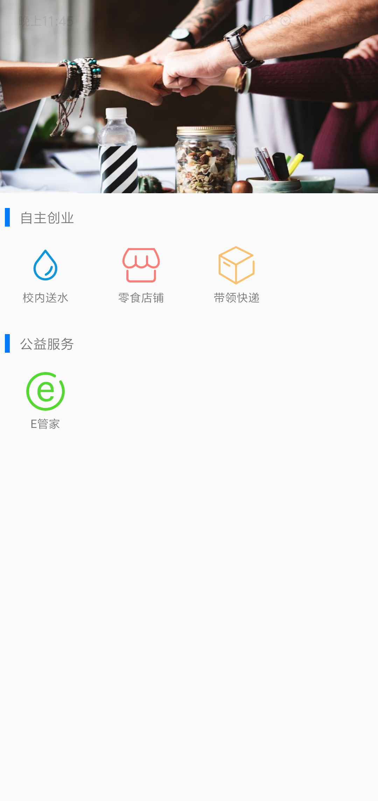
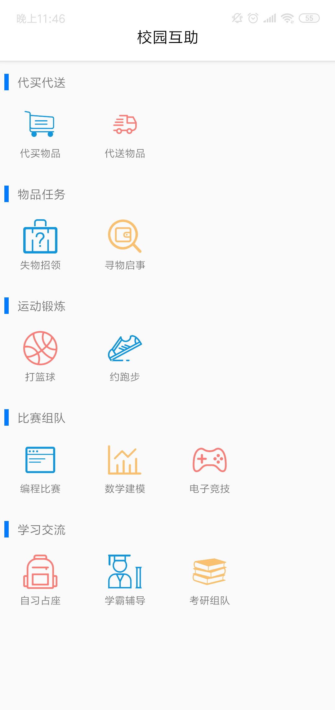
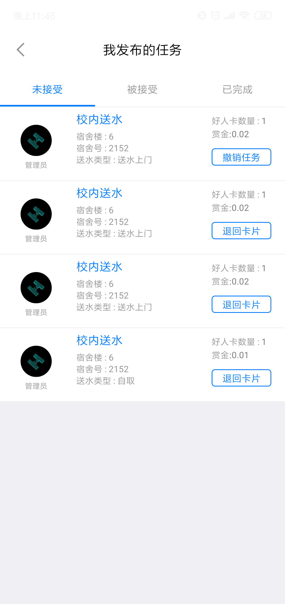

# TaskGo校园任务行-后端
> 任务驱动的校园综合服务平台，功能包括但不限于送水，失物招领，代取快递等。

## Screenshots

- 登录页
- 主页
- 个人信息页

 

- 创业团体页
- 校园互助页
- 任务页

 

## Android
> [@fhyPayaso](https://github.com/fhyPayaso) · [@Ajiajiajia](https://github.com/Ajiajiajia) · [@lszr-x](https://github.com/lszr-x)

[Android代码](https://github.com/fhyPayaso/TaskGo-Android)

## UI
> [@Ajiajiajia](https://github.com/Ajiajiajia)

## PM
> [@ZS-Oliver](https://github.com/ZS-Oliver) · [@ZGCTroy](https://github.com/ZGCTroy)

## Backend

> [@imyhui](https://github.com/imyhui/) · [@Yipartner](https://github.com/Yipartner)

Authored by [@imyhui](https://github.com/imyhui/)  Maintained by [@imyhui](https://github.com/imyhui/)

[@GitHub](<https://github.com/imyhui/TaskGo_BE>) 